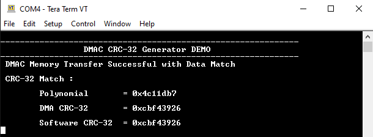

# DMAC CRC-32 Generation

This example application demonstrates how to use the DMAC peripheral to compute 32-bit Cyclic Redundancy Checksum (CRC).

## Description

The DMAC unit provides support for calculating a CRC-16 and CRC-32 value for data passing through any DMA channel.

This example application computes the 32-bit CRC value for the poynomial **(0x04C11DB7)** using the CRC engine in DMAC peripheral.

It uses a DMA Channel with software trigger to initiate a memory-memory transfer from the source buffer to the destination buffer with 8-bit beat size. Once the transfer is completed a 32-bit CRC will be generated for the source buffer.

Once the hardware CRC is generated using a DMA Channel it is validated using a software-calculated CRC value.

## Downloading and building the application

To clone or download this application from Github, go to the [main page of this repository](https://github.com/Microchip-MPLAB-Harmony/csp_apps_pic32mx) and then click **Clone** button to clone this repository or download as zip file.
This content can also be downloaded using content manager by following these [instructions](https://github.com/Microchip-MPLAB-Harmony/contentmanager/wiki).

Path of the application within the repository is **apps/dmac/dmac_crc32_generate/firmware** .

To build the application, refer to the following table and open the project using its IDE.

| Project Name      | Description                                    |
| ----------------- | ---------------------------------------------- |
| pic32mx470_curiosity.X | MPLABX project for [Curiosity PIC32MX470 Development Board](https://www.microchip.com/Developmenttools/ProductDetails/dm320103) |
|||

## Setting up the hardware

The following table shows the target hardware for the application projects.

| Project Name| Board|
|:---------|:---------:|
| pic32mx470_curiosity.X | [Curiosity PIC32MX470 Development Board](https://www.microchip.com/Developmenttools/ProductDetails/dm320103) |
|||

### Setting up [Curiosity PIC32MX470 Development Board](https://www.microchip.com/Developmenttools/ProductDetails/dm320103)

- To run the demo, the following additional hardware are required:
  - [USB UART click board](https://www.mikroe.com/usb-uart-click)

- Connect mini USB cable to the 'Debug USB' connector(J3) on the board to the computer
- Install an [USB UART click board](https://www.mikroe.com/usb-uart-click) on to the mikroBUS socket J5
- Connect mini USB cable between PC and the [USB UART click board](https://www.mikroe.com/usb-uart-click)
  - *Note: Ensure that the series resistors on the mikroBUS headers are of value 0 Ohms*

## Running the Application

1. Open the Terminal application (Ex.:Tera term) on the computer
2. Connect to the "USB to UART" COM port and configure the serial settings as follows:
    - Baud : 115200
    - Data : 8 Bits
    - Parity : None
    - Stop : 1 Bit
    - Flow Control : None
3. Build and Program the application project using its IDE
4. Following message is output on console:
   - Expected CRC Value for the polynomial **(0x04C11DB7)** is **(0xcbf43926)**

   

5. The LED indicates the success or failure:
   - LED is turned ON when the DMAC memory transfer is successful and hardware CRC value matches with the software calculated CRC value

Following table provides LED names:

| Board      | LED Name |
| ---------- |--------- |
|  [Curiosity PIC32MX470 Development Board](https://www.microchip.com/Developmenttools/ProductDetails/dm320103) | LED1 |
|||
