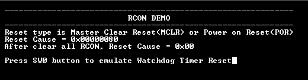
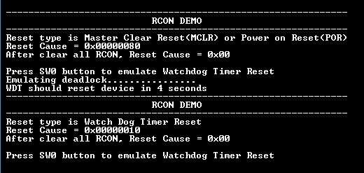

# RCON reset handler

This example shows how to use the RCON peripheral to indicate the cause of the device reset and clear the reset causes.

## Description

The Reset module combines all Reset sources and controls the device Master Reset signal, SYSRST. The Reset module allows the reset source to be identified and it clears the reset cause through software. The following is a list of device Reset sources:

- **POR**: Power-on Reset
- **MCLR**: Master Clear Reset pin
- **SWR**: Software Reset
- **WDTR**: Watchdog Timer Reset
- **BOR**: Brown-out Reset
- **CMR**: Configuration Mismatch Reset
- **HVDR**: High Voltage Detect Reset

This example application uses the RCON peripheral to indicate the MCLR and the Watchdog reset. The WDT reset is emulated by not feeding the watchdog on switch press.

## Downloading and building the application

To clone or download this application from Github, go to the [main page of this repository](https://github.com/Microchip-MPLAB-Harmony/csp_apps_pic32mx) and then click **Clone** button to clone this repository or download as zip file.
This content can also be downloaded using content manager by following these [instructions](https://github.com/Microchip-MPLAB-Harmony/contentmanager/wiki).

Path of the application within the repository is **apps/rcon/reset_handler/firmware** .

To build the application, refer to the following table and open the project using its IDE.

| Project Name      | Description                                    |
| ----------------- | ---------------------------------------------- |
| pic32mx470_curiosity.X | MPLABX project for [Curiosity PIC32MX470 Development Board](https://www.microchip.com/Developmenttools/ProductDetails/dm320103) |
|||

## Setting up the hardware

The following table shows the target hardware for the application projects.

| Project Name| Board|
|:---------|:---------:|
| pic32mx470_curiosity.X | [Curiosity PIC32MX470 Development Board](https://www.microchip.com/Developmenttools/ProductDetails/dm320103) |
|||

### Setting up [Curiosity PIC32MX470 Development Board](https://www.microchip.com/Developmenttools/ProductDetails/dm320103)

- To run the demo, the following additional hardware are required:
  - [USB UART click board](https://www.mikroe.com/usb-uart-click)

- Connect mini USB cable to the 'Debug USB' connector(J3) on the board to the computer
- Install an [USB UART click board](https://www.mikroe.com/usb-uart-click) on to the mikroBUS socket J5
- Connect mini USB cable between PC and the [USB UART click board](https://www.mikroe.com/usb-uart-click)
  - *Note: Ensure that the series resistors on the mikroBUS headers are of value 0 Ohms*

## Running the Application

1. Open the Terminal application (Ex.:Tera term) on the computer
2. Connect to the "USB to UART" COM port and configure the serial settings as follows:
    - Baud : 115200
    - Data : 8 Bits
    - Parity : None
    - Stop : 1 Bit
    - Flow Control : None
3. Build and Program the application project using its IDE
4. Following message is output on console:

    

5. Watch timer is fed periodically using Core Timer to prevent the WDT reset and the LED is toggled
    - Following table provides the switch and the LED name:

    | Board      | LED Name | Switch Name |
    | ---------- |--------- | ----------- |
    | [Curiosity PIC32MX470 Development Board](https://www.microchip.com/Developmenttools/ProductDetails/dm320103) | LED1 | S1 |

6. Press the switch to put the system in deadlock
7. LED should stop blinking and the console should print the following message

    

8. The WDT will reset the device in four seconds and the demonstration should restart